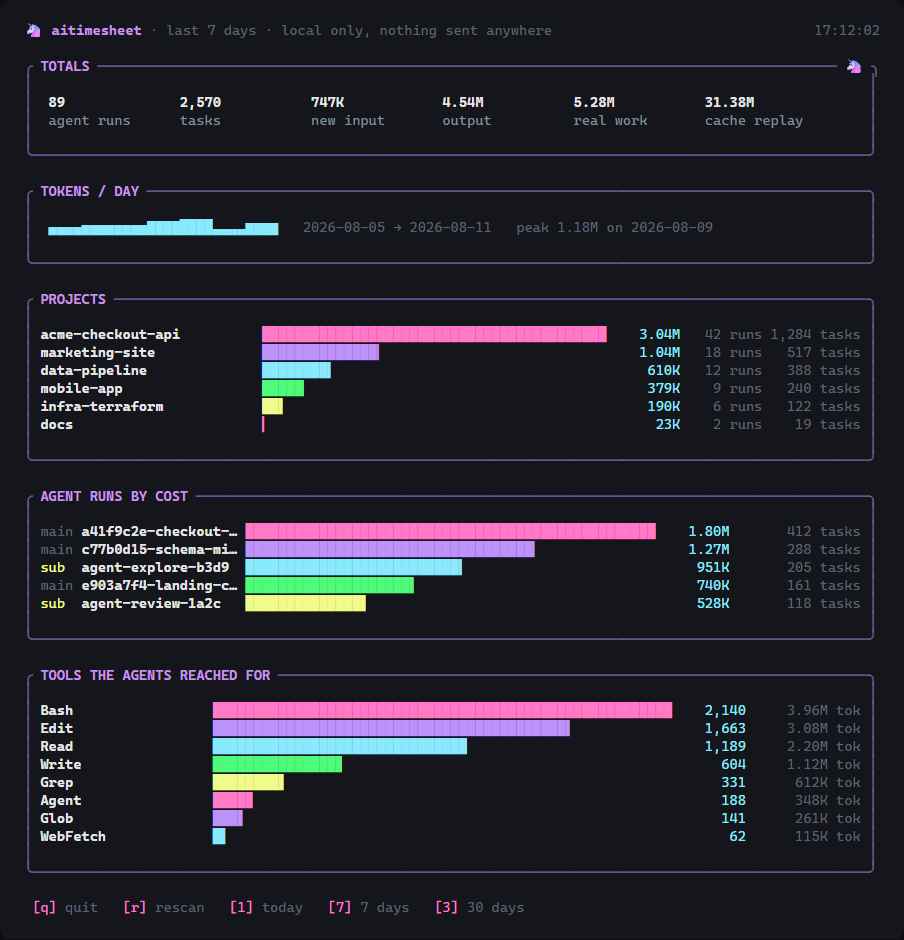
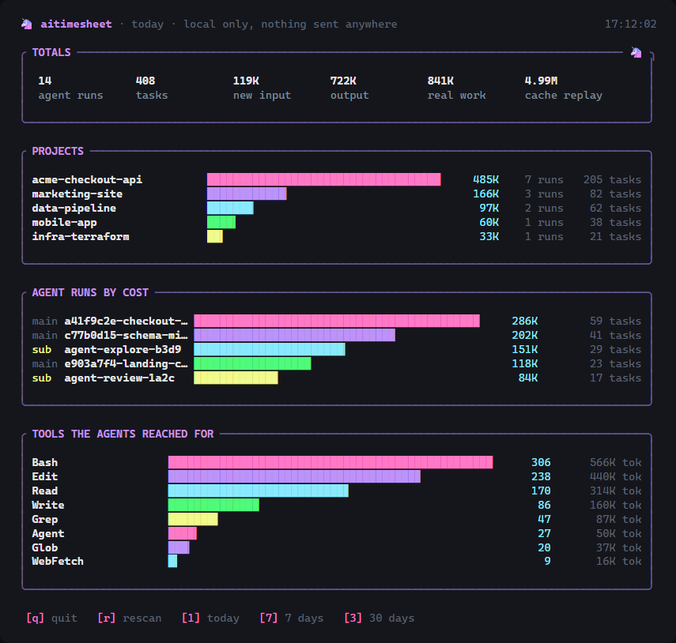

<div align="center">

# 🦄 aitimesheet

**A local, private timesheet for your Claude Code agents.**

How many agent sessions ran today. How many tasks they did. How many tokens they burned.
All of it read from files already on your disk, and none of it sent anywhere.

[](https://www.npmjs.com/package/aitimesheet)
[](LICENSE)
[](package.json)
[](#why-local-only)

</div>

---

## The dashboard lives in your terminal

```bash
npx aitimesheet tui
```



Press `1` for today, `7` for the week, `3` for the month, `r` to rescan, `q` to quit.
It refreshes itself while you work, so you can leave it open in a split pane and watch
your agents rack up tokens in real time.

<details>
<summary><b>See the single-day view</b></summary>

<br>



</details>

> The numbers above are synthetic demo data, generated by
> [`scripts/demo-data.js`](scripts/demo-data.js) and rendered through the exact
> same code path the live TUI uses. Your own run shows your own projects.

---

## Install

```bash
npm install -g aitimesheet
```

Or don't install anything:

```bash
npx aitimesheet tui
```

<details>
<summary><b>From source</b></summary>

<br>

```bash
git clone https://github.com/NapsterMayank/timesheet.git
cd timesheet
npm install
node bin/aitimesheet.js tui
```

</details>

<details>
<summary><b>Requirements &amp; native build notes</b></summary>

<br>

Node 18 or newer.

`better-sqlite3` is a native module. On most systems npm downloads a prebuilt
binary and you'll never notice. If your platform or Node version has no
prebuild, it compiles from source and needs a toolchain:

| Platform | What you need |
|---|---|
| Windows | Visual Studio Build Tools, "Desktop development with C++" workload |
| macOS | Xcode Command Line Tools (`xcode-select --install`) |
| Linux | `build-essential` and `python3` |

</details>

---

## Commands

| Command | What it does |
|---|---|
| `aitimesheet tui` | Live dashboard in your terminal. `--range 1\|7\|3` |
| `aitimesheet report` | One-shot table. `--days N` for a wider window |
| `aitimesheet dashboard` | Web dashboard on `127.0.0.1:4848`. `--port P` |
| `aitimesheet scan` | Read new transcript lines into the local database |

`scan` runs automatically before the other three, so you rarely call it
yourself. It's incremental: only lines added since the last run get read, so it
stays fast even with months of session history.

```console
$ aitimesheet report --days 7
┌────────────┬──────────────────┬────────────┬───────┬───────────┬────────────┬──────────────┐
│ Day        │ Project          │ Agent Runs │ Tasks │ Tokens In │ Tokens Out │ Total Tokens │
├────────────┼──────────────────┼────────────┼───────┼───────────┼────────────┼──────────────┤
│ 2026-08-11 │ acme-checkout-api│ 7          │ 205   │ 68,914    │ 416,203    │ 485,117      │
│ 2026-08-11 │ marketing-site   │ 3          │ 82    │ 25,881    │ 140,299    │ 166,180      │
└────────────┴──────────────────┴────────────┴───────┴───────────┴────────────┴──────────────┘
```

---

## What counts as what

**Agent run** — one Claude Code session file (`<session-id>.jsonl`). Subagent
transcripts under a session's `subagents/` folder count as their own runs, so a
session that spun up 3 subagents shows as 4 runs.

**Task** — one tool call (a `tool_use` block) anywhere in the transcript. Read,
Edit, Bash, Grep, whatever the agent reached for.

**Tokens** — this is where most usage tools quietly mislead you, so:

| Shown as | Field | What it really is |
|---|---|---|
| **new input** | `input_tokens` + `cache_creation_input_tokens` | Context the model genuinely read for the first time |
| **output** | `output_tokens` | What the model wrote |
| **real work** | the two above | The honest headline number |
| **cache replay** | `cache_read_input_tokens` | The same context re-sent every single turn |

`input_tokens` on its own is only the uncached sliver, often literally single
digits, so reporting it as "tokens in" understates reality by orders of
magnitude. `cache_read` is the opposite trap: it's real and it's billed, but
it's mostly the same bytes replayed hundreds of times, so leading with it makes
a 12M-token week look like 680M. aitimesheet reports both, separately, and
leads with real work.

Two counting traps this tool handles that a naive line-by-line reader doesn't:

- Claude Code writes one API message as **several transcript lines**, one per
  content block, repeating the identical `usage` on each. Summing per line
  double or triple counts. Rows are keyed on `message.id`, so repeats collapse.
- Tool calls are keyed on `tool_use.id` for the same reason, which also makes
  rescanning the same bytes a no-op.

**Per task and per agent** — each tool call is joined back to the message that
paid for it, so you get cost per tool. When one message fires several tool calls,
its cost is split evenly across them: an allocation, not a measurement, since the
API doesn't bill per tool call. Agent runs are grouped per session, with subagent
transcripts tracked separately.

---

## Why local-only

Session transcripts contain your source code, your file paths, and your command
output. A tool that ships that to someone else's server is a hard sell for most
teams, and shouldn't be trusted by default.

So, concretely, aitimesheet:

- reads only `~/.claude/projects/**/*.jsonl`
- writes only `~/.aitimesheet/db.sqlite`
- makes **no network requests**, of any kind, ever
- binds the web dashboard to `127.0.0.1` only, unreachable from your network

It's a few hundred lines of plain JavaScript with no build step. The terminal
dashboard is hand-rolled ANSI rather than a TUI framework, specifically so
there's no native binary in the trust path. Read [`src/`](src) and check all of
the above yourself, it won't take long.

---

## Roadmap

- [ ] An importable logger for agents built on the Claude Agent SDK / API, which
      don't write to `~/.claude/projects`, so custom agents land in the same database
- [ ] Per-model and per-cost breakdowns
- [ ] CSV export
- [ ] Weekly summary you can drop into a standup

---

## Contributing

Issues and PRs welcome, see [CONTRIBUTING.md](CONTRIBUTING.md). The two rules
that matter: no network calls, and no new dependencies without a reason.

Security issues go through [SECURITY.md](SECURITY.md), not a public issue.

## License

[MIT](LICENSE)
